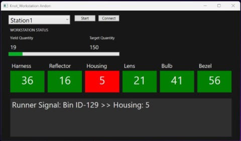

<h1 align="center">
    Manufacturing Simulation System
</h1>

Manufacturing Simulation is a system that was developed during the 2024 Advanced SQL course. This system has Configuration Setting, Simulator modules and Workstation, Part replenishment dashboards modules, and web API module for Microsoft SQL Server.

## Contents
- [Configuration Tool](https://github.com/minimalU/SET_2024_AdvancedSQL/tree/Project/Knot_ConfigurationTool)
- [Simulator](https://github.com/minimalU/SET_2024_AdvancedSQL/tree/Project/Knot_Simulator)
- [Worstation Andon](https://github.com/minimalU/SET_2024_AdvancedSQL/tree/Project/Knot_WorkstationAndon)
- [Assembly Line](https://github.com/minimalU/SET_2024_AdvancedSQL/tree/Project/Knot_AssemblyLine)
- [Replenishment Display](https://github.com/minimalU/SET_2024_AdvancedSQL/tree/Project/Knot_RunnerDisplay)
- [WEB API](https://github.com/minimalU/SET_2024_AdvancedSQL/tree/Project/Knot_LampManufacturingAPI)

## Configuration

## Simulator

## Workstation

## Replenishment

## Production Line

## .Net Web API

